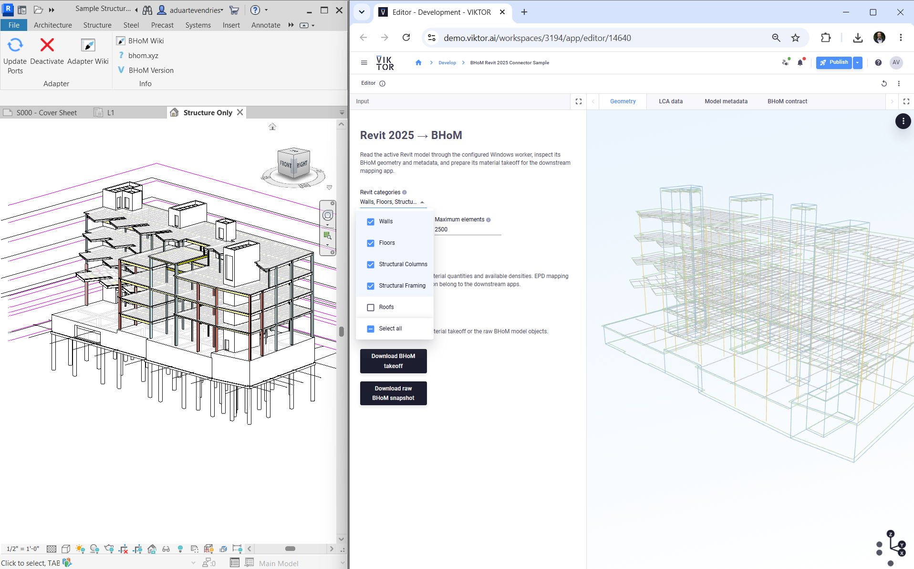
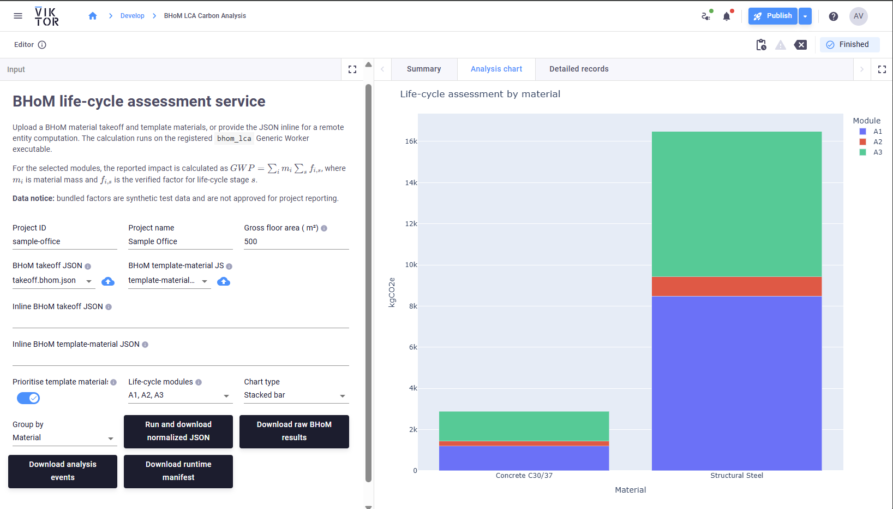

# BHoM + VIKTOR integration samples

This repository contains three VIKTOR apps forming a Revit extraction -> material/EPD mapping -> LCA workflow.

## Apps

### [VIKTOR BHoM Revit connector](viktor-bhom-revit-connector-sample)

Extract a BHoM model, geometry, and material takeoff from Revit.

### [VIKTOR BHoM material template mapping](viktor-bhom-material-template-mapping)

Match takeoff materials to installed BHoM Library_Engine datasets and export reusable templates.

### [VIKTOR BHoM LCA](viktor-bhom-lca-service-starter)

Consume mapped material data and calculate embodied carbon through BHoM LCA.

## VIKTOR Desktop and workers

VIKTOR Desktop provides the secure connection between cloud apps and Windows executables/BHoM installations.

Install and start the required Generic Worker on the Windows machine.

Each sample includes a YAML snippet that must be merged into that worker installation's `config.yaml`, preserving existing executable entries. Restart the worker after saving.

- [VIKTOR BHoM Revit connector worker configuration](viktor-bhom-revit-connector-sample/worker/config.example.yaml)
- [VIKTOR BHoM material template mapping worker configuration](viktor-bhom-material-template-mapping/worker/config.example.yaml)
- [VIKTOR BHoM LCA worker configuration](viktor-bhom-lca-service-starter/worker/config.example.yaml)

Confirm executable paths match the local installation before starting the worker.
