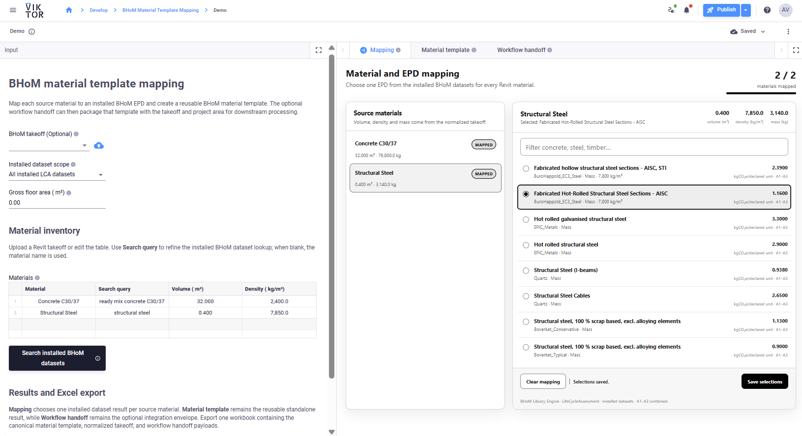
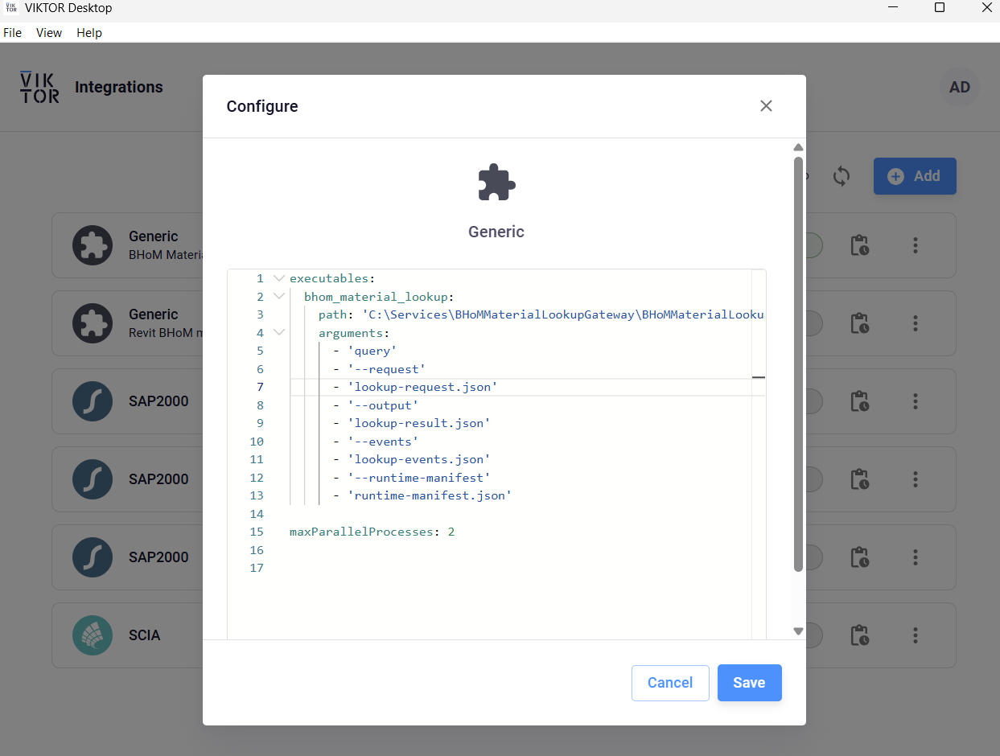

# BHoM material template mapping

This app is useful on its own: it maps source materials to typed EPDs installed with BHoM and produces a reusable BHoM `Material[]` template. It can also package that result for the sequential Revit-to-LCA workflow:

1. The Revit connector produces a BHoM `GeneralMaterialTakeoff`.
2. This app maps each takeoff material to an installed EPD and creates the material template.
3. The optional workflow handoff packages the takeoff, material template, and gross floor area for the LCA app.

## User flow and outputs

1. Upload `takeoff.bhom.json` or edit the material input table.
2. Choose the installed BHoM dataset scope and optionally refine each material's **Search query**.
3. Select **Search installed BHoM datasets**. A VIKTOR Generic Worker runs the .NET gateway.
4. Open **Mapping**. Choose one ranked dataset/EPD result per source material, then select **Save selections**.
5. Open **Material template** for the primary standalone result. It shows the validated BHoM material and EPD data used by **Export Excel**.
6. Open **Workflow handoff** only when integrating with a downstream workflow. It summarizes the envelope containing the same template, normalized takeoff, and gross floor area.
7. Select **Export Excel** to download `bhom-material-mapping.xlsx`.

The workbook contains exactly three worksheets: **Material template**, **Takeoff**, and **Workflow handoff**. Each sheet presents useful flattened scalar fields with typed numeric values; embedded JSON strings are not used as the main worksheet content.

The worker response is stored in `lookup_results_json`. The WebView saves selected BHoM GUIDs in the hidden `mapping_state_json` parametrization field. Both result views rebuild their content from that saved mapping and the worker's typed EPD payloads. The Excel export uses the same validated material-template builder, normalized takeoff, and `build_handoff` contract.

## Installed BHoM data

The gateway calls BHoM `Library_Engine.Query.Datasets` and reads the LifeCycleAssessment library installed under:

`C:\ProgramData\BHoM\Datasets\LifeCycleAssessment`



The selectable scopes are all installed LCA datasets, ICE, Boverket, local EC3 snapshots, EPiC, and Oekobaudat. The search is local: it does not call Carbon Query Database and does not require an API token.

## Windows Generic Worker

The executable key is `bhom_material_lookup`.



```powershell
.\scripts\build-gateway.ps1
.\worker\install-gateway.ps1
.\worker\diagnose.ps1
.\worker\run-local.ps1
.\scripts\test-lca-handoff.ps1
```

After building the gateway, run `worker\install-gateway.ps1` as Administrator and confirm that it installs `C:\Services\BHoMMaterialLookupGateway\BHoMMaterialLookupGateway.exe`. Merge `executables.bhom_material_lookup` from `worker/config.example.yaml` into the installed Generic Worker `config.yaml`, preserving every other executable entry. Production configuration is normally beside the installed worker under `C:\Program Files\Viktor\...\config.yaml`; development configuration is under the user-local VIKTOR installation. Save the file, then restart the worker because configuration is loaded at startup.

See `worker/INSTALL.md` for the complete setup.

## Development

```powershell
python -m venv venv
venv\Scripts\pip install -r requirements.txt
uvx ruff format .
uvx ruff check .
uvx ty check --python venv\Scripts\python.exe
venv\Scripts\python.exe -m pytest -q
viktor-cli test
viktor-cli start
```
